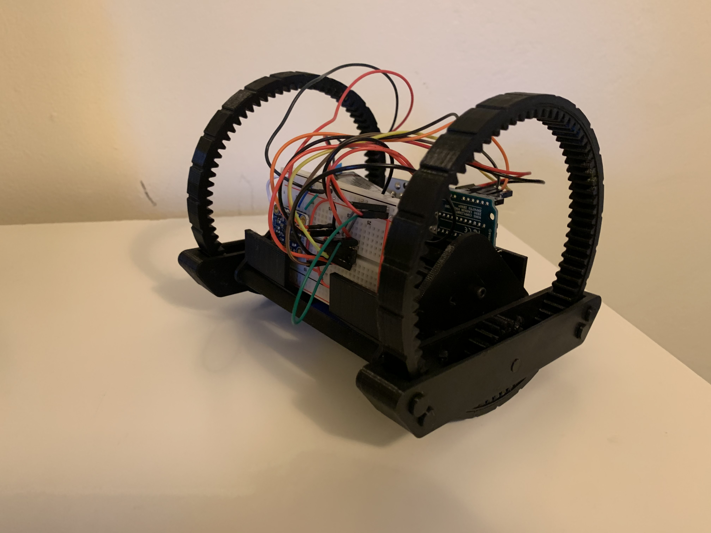

# Double Wheel Robot
A completely 3D printed robotics platform with a unique design. 

## Motivation
This project builds upon the snap fit and gear testing done with my Gearbox Mk1 Project. 
The idea was to create a completely 3D printed platform to experiment with PID control on Arduino in a unique robot body. The large wheels don't provide a whole lot of benefit other than looking unique. 

## Features

### Wheels
The large wheels have 5 points of contact:
- The gear which drives them
- 2 rollers on each side

###image

### Fully 3D Printed Body (almost)
Except for 6 M3-0.5 screws used to hold the motors, the entire body is 3D printed and held together with snap-fits or similar parts.

### Electronics
- On the center breadboard is a BNO055 IMU sensor.
- A L293DNE Quadruple Half H-Bridge is wired up to be 2 full H-Bridges and powers both the left and right motors.

### Motors

## Upgrades

### 12V Battery Pack
Driving the 12V DC motors with between 5V and 9V with the H-bridge proved to be too little voltage. The 12V battery pack uses 8 1.5V AA batteries to provide 12V to the motors.